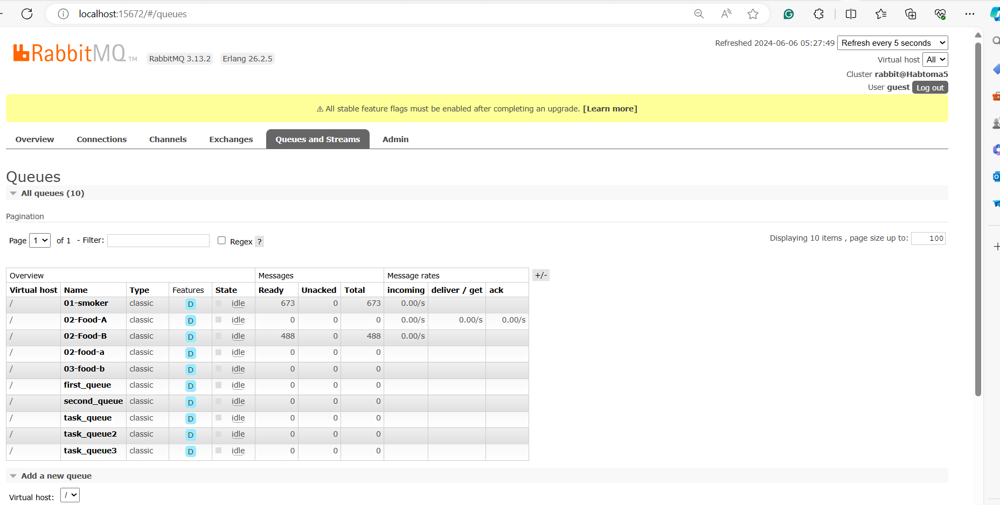

# streaming-06-smart-smoker-consumers
In this project, we'll add the consumers, implementing analytics based on a rolling window of time, and raise an alert when interesting events are detected.

# Overview 

The Smart Smoker Temperature Monitoring System is designed to monitor and manage the temperatures within a smoker, specifically targeting three critical areas: the smoker itself, and two food items being cooked (referred to as Food A and Food B). The system utilizes a combination of sensors, data streaming, and messaging queues to provide real-time monitoring and data analysis.

# Prequest 

Before running the project, ensure you have the following prerequisites:
Git
RabbitMQ server running

Python 3.10+ installed

VS studio Code

anaconda prompt (miniconda3)

The following modules are used in this project:
csv

webbrowser

signal

sys

time

pika

socket

deque

Required Python libraries (e.g., pika) installed in your active environment

# How to Run

Start the producer to collect temperature data:

Open separate terminal windows and start the consumers for smoker temperature and food temperatures:

Smoker Temperature Consumer:python consumer_smoker.py

Food A Temperature Consumer:python consumer-FoodA.py

Food B Temperature Consumer:python consumer-FoodB.py

# How it Works

A producer(bbq_producer_smoker.py) reads temperature data from a CSV file, simulating real-time sensor readings.

This data is then sent to RabbitMQ queues at regular intervals (e.g., every 30 seconds).

RabbitMQ serves as the message broker, receiving data from the producer and making it available for consumers.

Three consumers (consumer-smoker.py, consumer-FoodA.py and consumer-FoodB.py) retrieving data from the RabbitMQ queues for further processing or display.

# Screen shots

